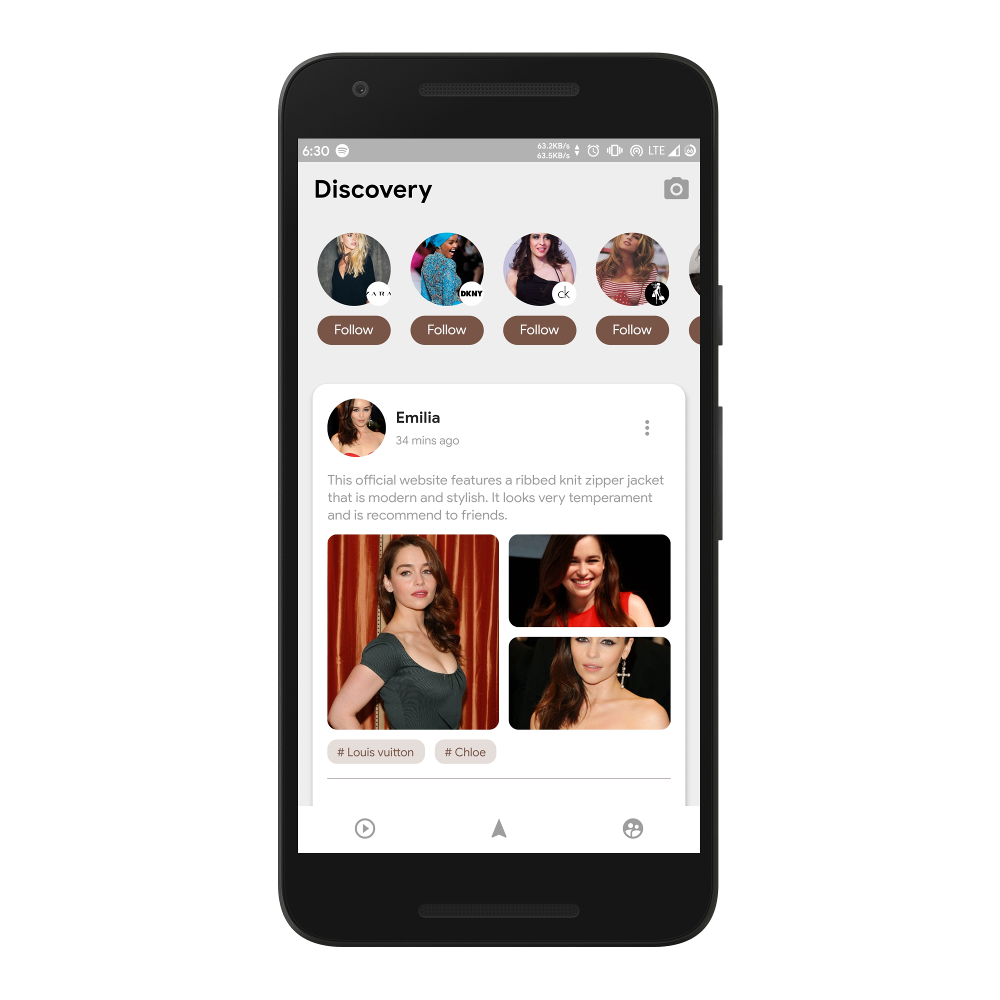
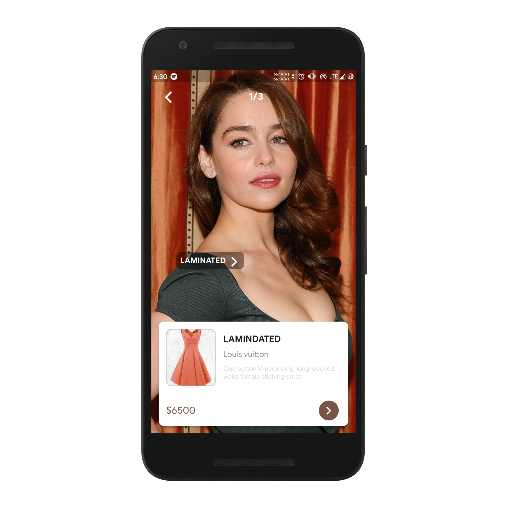

# Flutter Hire App

A Hire App UI Developed using Flutter.

Inspiration from a design made by [初夏 Ruby](https://dribbble.com/shots/5773232-Discovery-page)

# App Screenshots

Main Screen                
:-------------------------:
  |

Details Page                
:-------------------------:
  |

# Donate
> If you found this project helpful or you learned something from the source code and want to thank me, consider buying me a cup of :coffee::heart:

# Download
You can [download](https://github.com/AkashRajpurohit/Flutter-Fashion-App-UI/releases/download/v1.0.0/app-arm64-v8a-release.apk) the application for android and try it yourself.

# Bugs or Requests

If you encounter any problems feel free to open an [issue](https://github.com/AkashRajpurohit/Flutter-Fashion-App-UI/issues/new). Pull requests are also welcome.

## Visit My Portfolio
[Akash Rajpurohit](https://akashwho.codes)